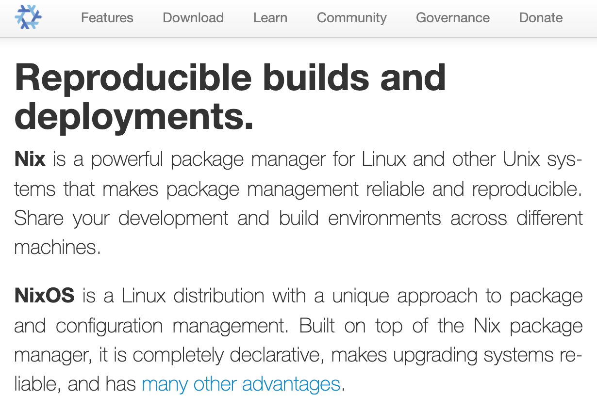

% Functional package management -- does it function?
% Michael Noronha
% July 2, 2020

## NixOS



## Purely functional

- The thing returned is always the same for the same inputs
  - Reproducible
- Most package managers (eg. `homebrew`) are _imperative_
  - Do this, then do this, then do this...
  - Lots of state can be hard to manage

## Builds things in isolation, with no overwriting

```
[mtn@mtnpc:~]$ file `which python`
/run/current-system/sw/bin/python: symbolic link to /nix/store/vhnb9dk5py14by8rfrb45a0pi1cy4lk9-python3-3.7.6/bin/python
```

- Mechanism: hash the configuration to decide where to store it
  - Content-addressable storage
- Different versions are stored separately
- Installing/upgrading one package can't break another


## Easy to try

- Can be used as a package manger on linux or macOS
- Strength: portability across systems
  - Less time setting up environments

## nix-shell

```
with import <nixpkgs> {};

let
  py = pkgs.python37;
in
stdenv.mkDerivation rec {
  name = "python-environment";

  buildInputs = [
    py
    swig4
    cudatoolkit_10
    py.pkgs.opencv4
    py.pkgs.flask
  ];

  shellHooks = ''
    echo "Hello world"
  '';
}
```

- Similar idea to virtual environments in python
- Generalizes over different languages, tools, and libraries
- Each argument pulls in a package that's configured in the nixpkgs package repository

## home-manager

```
{ pkgs, ... }:

{
  home.packages = [
    pkgs.htop
    pkgs.fortune
  ];

  programs.firefox = {
    enable = true;
    profiles = {
      myprofile = {
        settings = {
          "general.smoothScroll" = false;
        };
      };
    };
  };

  programs.home-manager = {
    enable = true;
    path = "…";
  };
}
```

- Can also be used to configure your user environment

## System environment

```
...
  # Enable the X11 windowing system.
  services.xserver.enable = true;
  services.xserver.autorun = true;
  services.xserver.layout = "us";
  services.xserver.videoDrivers = ["nvidia"];
...
```

- Or your system environment

## Generations

```
[mtn@mtnpc:~]$ nix-env --list-generations
   5   2019-05-28 14:49:18
   6   2019-05-29 21:43:41
   7   2019-05-29 21:48:29
   8   2019-05-29 23:41:56
   9   2019-05-29 23:45:12
  10   2020-06-10 23:55:17
  11   2020-06-21 03:07:37   (current)
```

- Rolling back is really easy

## Learn more

- [NixCloud tour](http://nixcloud.io/tour/)
    - An interactive tour of the nix language
- [Motivation For Nix/Nixpkgs/NixOS](https://www.youtube.com/watch?v=QpRgu5Dxp68)
    - A walk-through of some high-level motivation and examples
- [My NixOS Desktop Flow](https://christine.website/blog/nixos-desktop-flow-2020-04-25)
    - A nice blog post about how someone uses Nix/NixOS
